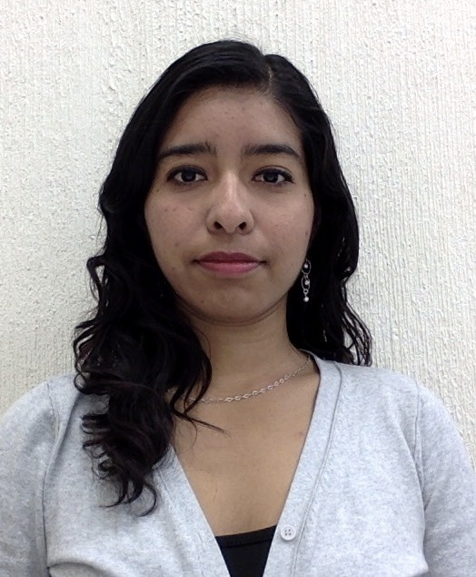
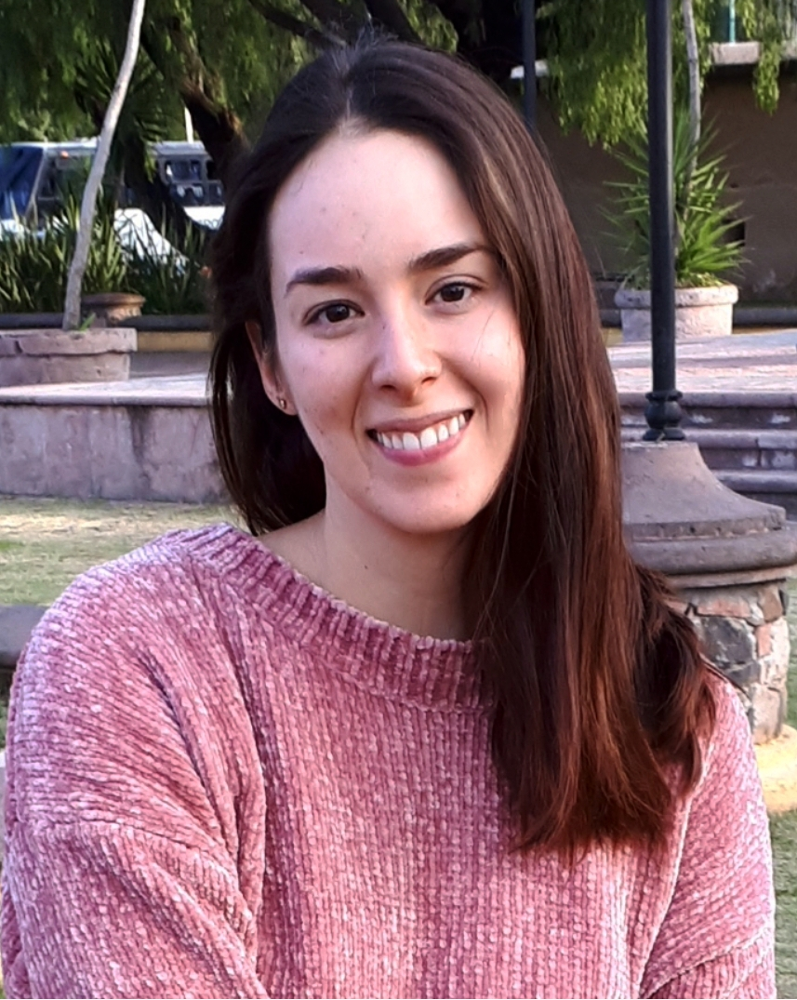

<style>
  .col2 {
    columns: 2 200px;         /* number of columns and width in pixels*/
    -webkit-columns: 2 200px; /* chrome, safari */
    -moz-columns: 2 200px;    /* firefox */
  }
</style>
 

```{r load_packages, message=FALSE, warning=FALSE, include=FALSE} 
library(fontawesome)
```

<script>
  $(document).ready(function() {
    $('#TOC').parent().prepend('<div id=\"nav_logo\"></div>');
  });
</script>

<style>
#nav_logo {
  width: 100%;
  margin-top: 20px;
}
</style>


<br>


This is our first lab retreat and it was focused in __“Learn what colleagues are working on”__, the retreat was in Queretaro, Mexico.   

<br>


<style>
div.red { background-color:#ffe6e6; border-radius: 5px; padding: 20px;}
</style>

<div class = "red">
## Genomic Regulation
</div>

<br>

### Karen Julia Nuñez-Reza

<br>

<div class="col2">

##### `r fa("briefcase", fill= "steelblue")` Modeling the regulatory network controlling dendritic cell differentiation from human monocytes

<br>

Ph.D. student in Biomedical science 



</div>

<br>
<br>

---

### Ana Victoria Leon Apodaca 

<br>

<div class="col2">


##### `r fa("briefcase", fill= "steelblue")` Modelling the regulatory network controlling dendritic cell differentiation from human monocytes

<br>

Undergrad student (internship)  



</div>

<br>
<br>

---

### Lucia Ramirez 


<br>

<div class="col2">


##### `r fa("briefcase", fill= "steelblue")` ?

<br>

?


</div>

<br>
<br>

---


### Darely Y. Guitierrez-Reyna

<br>

<div class="col2">


##### `r fa("briefcase", fill= "steelblue")` Transcriptional Factors associated with epigenome regulatory regions from neonates and adults CD8+ T cells

<br>

Ph.D. student in Sciences 


</div>

<br>
<br>

---


### Brenda Pardo

<br>

<div class="col2">


##### `r fa("briefcase", fill= "steelblue")` Modeling the regulatory network controlling dendritic cell differentiation from human monocytes

<br>

Undergraduate student in Genomic Sciences Program


</div>

<br>
<br>

---


<style>
div.green { background-color:#e6ffe6; border-radius: 5px; padding: 20px;}
</style>

<div class = "green">


## Tools

</div>

<br>

### Maria Jose Rocha


<br>

<div class="col2">


##### `r fa("briefcase", fill= "steelblue")` Modeling the regulatory network controlling dendritic cell differentiation from human monocytes

<br>

Ph.D. student in Biomedical science 


</div>

<br>
<br>

---


### Cristian Jesus Gonzalez


<br>

<div class="col2">


##### `r fa("briefcase", fill= "steelblue")` ?

<br>

? 


</div>

<br>
<br>

---

### Monica Padilla

<br>

<div class="col2">


##### `r fa("briefcase", fill= "steelblue")` ?

<br>

Undergraduate student in Genomic Sciences Program 


</div>

<br>
<br>

---


<style>
div.blue { background-color:#e6f0ff; border-radius: 5px; padding: 20px;}
</style>

<div class = "blue">


## Data Bases

</div>

<br>

### Ana Beatriz Villaseñor-Altamirano


<br>

<div class="col2">


##### `r fa("briefcase", fill= "steelblue")` PulmonDB: a gene expression lung diseases database

<br>

Ph.D. student in Biomedical science 


</div>

<br>
<br>

---


### Alba Mayra Padilla Correa


<br>

<div class="col2">


##### `r fa("briefcase", fill= "steelblue")` Biological mechanisms in COPD

<br>

Medical Doctor student


</div>

<br>
<br>

---


### Oscar A. Aldana Assad 


<br>

<div class="col2">


##### `r fa("briefcase", fill= "steelblue")` Mexican twin registry 

<br>

Undergrad student in Software Engineering 


</div>

<br>
<br>

---


<style>
div.violet { background-color:#ffe6fc; border-radius: 5px; padding: 20px;}
</style>

<div class = "violet">

## Keynote plenary

</div>

<br>

### Alejandra Medina-Rivera

<br>

<div class="col2">


##### `r fa("briefcase", fill= "steelblue")` Be the boss

<br>

Super PI at LIIGH and head of RegGenoLab 


</div>

<br>
<br>

---


### Morgane Thomas-Chollier


<br>

<div class="col2">


##### `r fa("briefcase", fill= "steelblue")` Super cool tools

<br>

Another super PI from France 


</div>

<br>
<br>

---

 
 
 
 
<br>

## Schedule 

<br>

<style>
div.yellow { background-color:#e5e5e5; border-radius: 5px; padding: 20px;}
</style>

<div class = "yellow">


Session | Start | End
------------- | ------------- | -------------
Genomic Regulation | 12:00 pm | 1:10 pm 
`r fa("coffee", fill= "#a464c4", height = 20)` Coffe brake   |  1:10 pm | 1:20 pm
Tools | 1:30 pm | 2:40 pm
`r fa("utensils", fill= "#a464c4", height = 20)` Lunch |  2:40 pm | 3:00 pm 
Data Bases | 3:00 pm | 4:00 pm
`r fa("camera", fill= "#a464c4", height = 20)` Photo  | 4:00 pm | 4:10 pm
Keynote plenary  | 4:10 | 4:50 pm
End | 4:50 pm | 5:00 pm

</div>

<br>
<br>

---

<br>
<br>

<center>
 {width=20%}
 {width=20%}
 {width=20%}
</center>
